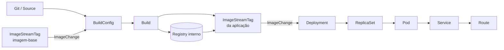
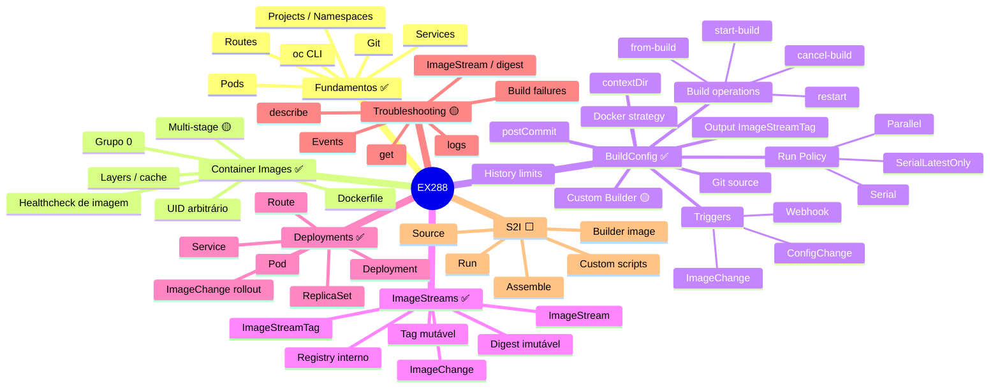
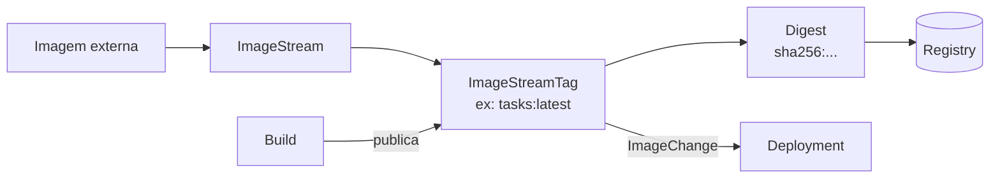
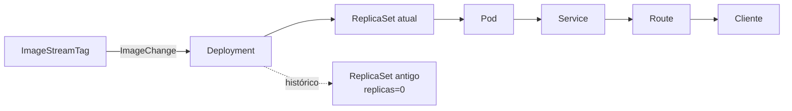
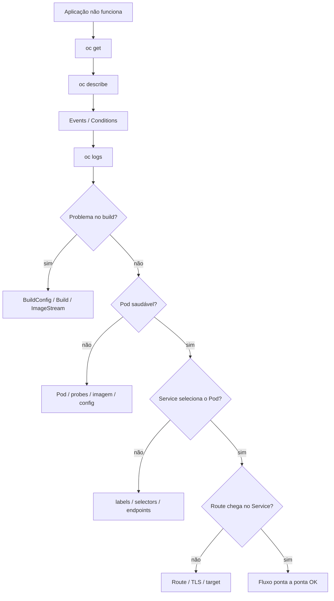
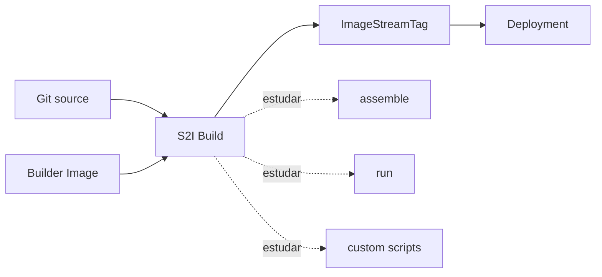

# EX288 — Mindmap navegável

[← Voltar para o README principal](../README.md)

Este mapa cresce junto com os estudos. O objetivo é mostrar **como os objetos do OpenShift se conectam** e fornecer atalhos para os capítulos técnicos do repositório.

## Navegação rápida

| Área | Status | Material |
|---|---|---|
| Fundamentos OpenShift e Git | ✅ | [Abrir](../topics/01-openshift-git/) |
| Container Images | ✅ / 🟡 multi-stage | [Abrir](../topics/02-container-images/) |
| BuildConfig e Builds | ✅ / 🟡 custom builder | [Abrir](../topics/03-buildconfig-builds/) |
| ImageStreams | ✅ / 🟡 troubleshooting | [Abrir](../topics/04-imagestreams/) |
| S2I | ⬜ próximo | README técnico será criado ao iniciar |
| Deployments e aplicações | ✅ / 🟡 rollout history | [Abrir](../topics/08-deployments-applications/) |
| Troubleshooting | 🟡 | [Abrir](../topics/09-troubleshooting/) |

## Visão geral do fluxo já praticado



### Fluxo automático que já foi validado

```text
imagem-base muda de digest
        ↓
ImageChange do BuildConfig
        ↓
Build automático
        ↓
imagem da aplicação muda
        ↓
ImageChange do Deployment
        ↓
rollout automático
```

---

## Mapa dos domínios



---

## BuildConfig — mapa operacional

```mermaid
flowchart TD
    BC[BuildConfig]

    BC --> SRC[Source]
    SRC --> GIT[Git repository]
    SRC --> CTX[contextDir]

    BC --> STRAT[Strategy]
    STRAT --> DOCKER[Docker / Containerfile]
    STRAT --> CUSTOM[Custom Strategy 🟡]
    STRAT -. próximo .-> S2I[S2I]

    BC --> TRIG[Triggers]
    TRIG --> CONFIG[ConfigChange]
    TRIG --> IMAGE[ImageChange]
    TRIG --> WEBHOOK[GitHub / Generic webhook]

    BC --> OPS[Operações]
    OPS --> START[oc start-build]
    OPS --> CANCEL[oc cancel-build]
    OPS --> RESTART[oc cancel-build --restart]
    OPS --> FROMBUILD[oc start-build --from-build]

    BC --> POLICY[Run Policy]
    POLICY --> SERIAL[Serial]
    POLICY --> PARALLEL[Parallel]
    POLICY --> LATEST[SerialLatestOnly]

    BC --> HISTORY[History limits]
    HISTORY --> SUCCESS[successfulBuildsHistoryLimit]
    HISTORY --> FAILED[failedBuildsHistoryLimit]

    BC --> HOOK[postCommit]
```



### Comandos-chave

```bash
oc new-build --name <nome> -l app=<nome> --strategy=docker <git-url> --context-dir=<dir>
oc get bc
oc describe bc <nome>
oc set triggers bc/<nome>
oc start-build <nome> --follow
oc cancel-build <build>
oc cancel-build <build> --restart
oc start-build --from-build=<build>
oc set build-hook bc/<nome> --post-commit --script='<comando>'
oc edit bc/<nome>
```

---

## ImageStreams — modelo mental



```text
Tag
→ ponteiro mutável

Digest
→ referência imutável de uma imagem específica
```

Pegadinha já validada:

```text
oc tag A B

A e B apontam para o mesmo digest
→ não há mudança real de imagem
→ não é um bom teste de ImageChange
```

---

## Deployment — fluxo de runtime



Comandos-chave:

```bash
oc create deployment <nome> --image=<imagem>
oc expose deployment <nome> --port=8080 --target-port=8080
oc create route edge --service=<nome> --insecure-policy=Redirect
oc set triggers deployment/<nome> --from-image=<imagestream>:latest -c <container>
oc rollout history deployment/<nome>
```

Observação já validada: ao omitir o nome em `oc create route edge --service=<service>`, a Route pode usar o nome do Service.

---

## Troubleshooting — fluxo de decisão



Casos reais já encontrados nos labs:

- `BuildConfigInstantiateFailed` enquanto uma imagem-base ainda não estava resolvida.
- webhook chegando como `system:anonymous` e falhando por RBAC.
- `tasks:latest`/`vote:latest` atualizado enquanto o Pod continuava com digest antigo.
- `imagePullPolicy: Always` não provoca rollout sozinho.
- `contextDir` define contexto de build, não filtra eventos do webhook por caminho.
- `postCommit` com exit code diferente de zero faz o Build falhar.

---

## Próximo ramo: S2I



Quando S2I começar, será criado o capítulo correspondente em `topics/` e este mapa será expandido.

---

## Regra de manutenção

Ao terminar um bloco de estudo:

```text
README raiz
→ atualizar progresso

mindmap/README.md
→ atualizar relações e fluxos

topics/XX-*/README.md
→ registrar comandos, exemplos e troubleshooting
```
